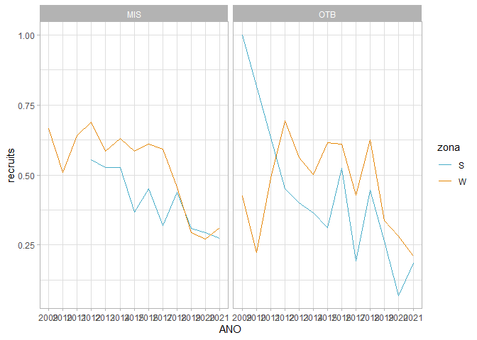
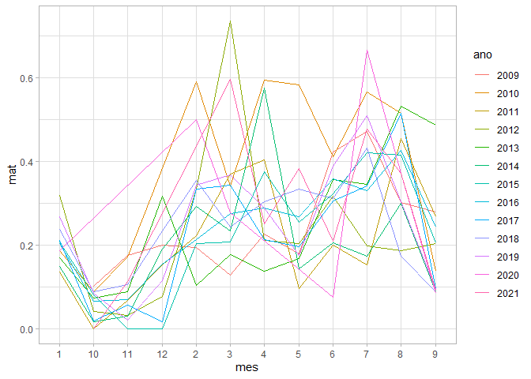

Polvices indecentes!
================
Alberto Rocha, David Dinis, Beatriz Dinis, Ana Moreno
2022-05-31

``` r
# TODO
# 

# Compilar lista de problemas

## SIC
# 114626 - classes de comprimento fodidas
# 111077 - ??

# Ver impacto do campo novo, processamento
```

``` r
knitr::opts_chunk$set(
  warning = T,
  message = T,
  error = T) 
library(ggplot2)
library(ggpmisc)
```

    ## Warning: package 'ggpmisc' was built under R version 4.1.2

    ## Loading required package: ggpp

    ## Warning: package 'ggpp' was built under R version 4.1.2

    ## 
    ## Attaching package: 'ggpp'

    ## The following object is masked from 'package:ggplot2':
    ## 
    ##     annotate

``` r
library(dplyr)
```

    ## 
    ## Attaching package: 'dplyr'

    ## The following objects are masked from 'package:stats':
    ## 
    ##     filter, lag

    ## The following objects are masked from 'package:base':
    ## 
    ##     intersect, setdiff, setequal, union

``` r
library(reshape2)
library(openxlsx)
library(data.table)
```

    ## 
    ## Attaching package: 'data.table'

    ## The following objects are masked from 'package:reshape2':
    ## 
    ##     dcast, melt

    ## The following objects are masked from 'package:dplyr':
    ## 
    ##     between, first, last

``` r
library(ggpubr)
library(extrafont)
```

    ## Warning: package 'extrafont' was built under R version 4.1.3

    ## Registering fonts with R

``` r
# CRL DAVID!
library(wesanderson)
```

    ## Warning: package 'wesanderson' was built under R version 4.1.3

``` r
library(hrbrthemes) # for plot themes
```

    ## Warning: package 'hrbrthemes' was built under R version 4.1.3

    ## NOTE: Either Arial Narrow or Roboto Condensed fonts are required to use these themes.

    ##       Please use hrbrthemes::import_roboto_condensed() to install Roboto Condensed and

    ##       if Arial Narrow is not on your system, please see https://bit.ly/arialnarrow

``` r
library(gapminder) # for data
```

    ## Warning: package 'gapminder' was built under R version 4.1.3

``` r
library(ggbump) # for the bump plot
```

    ## Warning: package 'ggbump' was built under R version 4.1.3

``` r
# dados = 'Z://Documents//PNAB/'
```

# Importar e limpar dados

``` r
source('C://repos/path.R'); path('local')
```

    ## [1] "possible paths: {'local', 'remote'}"
    ## [1] "dados: C://dados_pnab/"
    ## [1] "repo: C://repos/"

``` r
# load(paste0(dados,'//2022_occ_tmp//2020_2021_raw.RData'))
load(paste0(dados,'//2022_occ_tmp//2020_2021_raw_update.RData'))
load(paste0(dados,'//2022_occ_tmp//index_metiers.rdata'))


# dados lotas SIC
source('scripts/cmp_sic.R', encoding = 'utf-8')

# portos_slv
source('scripts/portos.R', encoding = 'utf-8')

# desembarques
source('scripts/land.R')
```

    ## `summarise()` has grouped output by 'PORTO_NOME', 'EGRUPART', 'COD_FAO', 'ANO', 'MES'. You can override using the `.groups` argument.

``` r
# vendas_dia dos anos 2017-2021
# source('scripts/vd_import.R')

# dados biologicas antigos
source('scripts/bio_sic.R')

# dados biologicas novos
source('scripts/bio_naut.R')
```

    ## `summarise()` has grouped output by 'ano', 'trim'. You can override using the `.groups` argument.

``` r
# dados lotas nautilus tirado com script para comprimentos
source('scripts/cmp_naut1.R')

# dados lotas nautilus tirado com script para biologicas
source('scripts/cmp_naut2.R')

# Executa uma serie de limpezas e corrige formatos
# Cria parametros de regressao peso-comprimento por ano e regiao
# Converte pesos em comprimentos e comprimentos em pesos
# Faz levantamento dos dados de classes
# Outputs que interessam: naut_cmp - tabela com classes de comprimento 
#                         naut_peso - tabela com classes de peso
source('scripts/bio_proc.R')
```

    ## `summarise()` has grouped output by 'ano'. You can override using the `.groups` argument.

    ## `summarise()` has grouped output by 'codporto', 'id_viagem', 'id_denominacao', 'id_caixa', 'id_spp', 'REGIAO', 'DATA', 'ANO', 'MES', 'PORTO', 'GEAR', 'cat_com', 'especie_am', 'land_kg', 'peso_amostrado_dom', 'peso_total_caixa', 'peso_am_caixa', 'peso_total_spp', 'peso_am_spp', 'n_total_caixa', 'n_amostrados_caixa', 'n_total_spp', 'n_amostrado_comprimentos', 'n_nao_observados_tot', 'classe_comp'. You can override using the `.groups` argument.

    ## `summarise()` has grouped output by 'codporto', 'id_viagem', 'id_denominacao', 'id_caixa', 'id_spp', 'REGIAO', 'DATA', 'ANO', 'MES', 'PORTO', 'GEAR', 'cat_com', 'especie_am', 'land_kg', 'peso_amostrado_dom', 'peso_total_caixa', 'peso_am_caixa', 'peso_total_spp', 'peso_am_spp', 'n_total_caixa', 'n_amostrados_caixa', 'n_total_spp', 'n_amostrado_comprimentos', 'n_nao_observados_tot', 'classe_peso'. You can override using the `.groups` argument.

``` r
# ampliações ao desembarque
source('scripts/amp.R')
```

    ## `summarise()` has grouped output by 'id_viagem'. You can override using the `.groups` argument.

    ## `summarise()` has grouped output by 'ANO', 'MES', 'REGIAO'. You can override using the `.groups` argument.

    ## `summarise()` has grouped output by 'id_viagem', 'ANO', 'MES', 'REGIAO', 'GEAR'. You can override using the `.groups` argument.

    ## `summarise()` has grouped output by 'id_viagem', 'ANO', 'MES', 'REGIAO'. You can override using the `.groups` argument.

    ## `summarise()` has grouped output by 'ANO', 'REGIAO', 'MES'. You can override using the `.groups` argument.

    ## `summarise()` has grouped output by 'ANO', 'MES', 'REGIAO', 'GEAR'. You can override using the `.groups` argument.

    ## `summarise()` has grouped output by 'ANO', 'MES', 'zona', 'GEAR'. You can override using the `.groups` argument.

``` r
#
source('scripts/participesca_17_maio.R')
```

    ## `summarise()` has grouped output by 'ANO', 'GEAR'. You can override using the `.groups` argument.

    ## `summarise()` has grouped output by 'ANO', 'zona'. You can override using the `.groups` argument.

    ## Error in is.data.frame(y): object 'land_zonas' not found

# Quality Control

-   Nr de individuos medidos na lota16: 145289

-   Nr de medidos na nautilus: 7931

-   Nr de pesados na nautilus: 44175

-   Total no objecto final: 196778

``` r
qc_sic = lota16 %>% 
  group_by(ID_VIAGEM) %>% 
  summarise(peso_amostra = unique(PESO_AM),
            n = sum(INDIF, na.rm = T),
            check = peso_amostra/n)
```

## Landings

``` r
  land %>%
  filter(ANO %in% c(2009:2021)) %>% 
  filter(EGRUPART != 'PS') %>% 
  mutate(zona = case_when(REGIAO == '27.9.a.s.a' ~ 'S',
                          T ~'W')) %>% 
  group_by(zona, EGRUPART, ANO) %>% 
  summarise(QVENDA = sum(land_kg)/1000) %>% 
  ggplot() + 
  geom_bar(aes(x = ANO, y = QVENDA, fill = EGRUPART),
           stat = 'identity', position = 'dodge',
           col = 'black') +
  theme_light() + 
  theme(axis.text.x = element_text(angle = 90),
        legend.position = 'none',
        panel.grid.major = element_blank(),
        panel.grid.minor = element_blank()
        ) +
  facet_grid(EGRUPART ~ zona, scales = 'free_y') + 
  scale_fill_manual(values = wes_palette('FantasticFox1', n = 2)) +
  labs(x = 'Year', y = ' landings (tonnes)', fill = "")
```

    ## `summarise()` has grouped output by 'zona', 'EGRUPART'. You can override using the `.groups` argument.


## Numero de individuos/classe de comprimento

``` r
# title_italic =  expression(paste("Weight class frequency distribution - ", italic("OTB"))))

  amp_peso %>%
  filter(ANO %in% c(2012:2021)) %>%
  filter(GEAR == 'OTB') %>% 
  group_by(zona, GEAR, ANO, classe_peso) %>% 
  summarise(freq = sum(n_ampliados)/1000) %>% 
  
  
  ggplot() + 
  geom_bar(aes(x = classe_peso, y = freq, fill = GEAR),
           stat = 'identity', position = 'dodge',
           col = 'black') +
  theme_light() + 
  theme(axis.text.x = element_text(angle = 90, size = 5),
        legend.position = 'none',
        panel.grid.major = element_blank(),
        panel.grid.minor = element_blank()
        ) +
  facet_grid(zona ~ ANO, scales = 'free_y') + 
  scale_fill_manual(values = wes_palette('FantasticFox1', n = 3)) +
  labs(x = expression(weight~class~Delta~"="~"50g"),
       y = expression(10^{3}~"individuals"), fill = "",
       title = 'Weight class frequency distribution - OTB')
```

    ## `summarise()` has grouped output by 'zona', 'GEAR', 'ANO'. You can override using the `.groups` argument.


``` r
  amp_peso %>%
  filter(ANO %in% c(2012:2021)) %>% 
    filter(GEAR == 'MIS') %>% 
  group_by(zona, GEAR, ANO, classe_peso) %>% 
  summarise(freq = sum(n_ampliados)/1000) %>% 
  
  
  ggplot() + 
  geom_bar(aes(x = classe_peso, y = freq, fill = GEAR),
           stat = 'identity', position = 'dodge',
           col = 'black') +
  theme_light() + 
  theme(axis.text.x = element_text(angle = 90, size = 5),
        legend.position = 'none',
        panel.grid.major = element_blank(),
        panel.grid.minor = element_blank()
        ) +
  facet_grid(zona ~ ANO, scales = 'free_y') + 
  scale_fill_manual(values = wes_palette('FantasticFox1', n = 3)) +
  labs(x = expression(weight~class~Delta~"="~"50g"),
       y = expression(10^{3}~"individuals"), fill = "",
       title = 'Weight class frequency distribution - MIS_MIS')
```

    ## `summarise()` has grouped output by 'zona', 'GEAR', 'ANO'. You can override using the `.groups` argument.


## Recruitment

Number of individuals &lt;= Modal class

``` r
classe_modal = 
amp_peso %>% 
  group_by(classe_peso) %>% 
  summarise(n = sum(n_ampliados)) 

classe_modal = classe_modal$classe_peso[which.max(classe_modal$n)]

# amp_peso %>% 
#   group_by(classe_peso) %>% 
#   summarise(n = sum(n_ampliados)) %>% 
#   ggplot() +
#   geom_bar(stat = 'identity',
#            aes(x = classe_peso, y = n)) + 
#   xlim(0,3000)
```

``` r
amp_peso %>% 
  group_by(ANO, GEAR, zona) %>% 
  summarise(recruits = sum(n_ampliados[classe_peso <= classe_modal]) / sum(n_ampliados)) %>% 
  ggplot() + 
  geom_line(aes(x = ANO,
                y = recruits,
                group = zona,
                color = zona)) + 
  facet_wrap(GEAR ~ .) +
  scale_color_manual(values = wes_palette('FantasticFox1', n = 4)[3:4]) + theme_light()
```

    ## `summarise()` has grouped output by 'ANO', 'GEAR'. You can override using the `.groups` argument.



``` r
amp_peso %>%
  mutate(  MES = as.numeric(as.character(MES)),
           ANO = as.numeric(as.character(ANO)),
           ano_mes = zoo::as.yearmon(paste(ANO, MES, sep = '-'))) %>% 
  group_by(ano_mes, GEAR, zona) %>% 
  summarise(recruits = sum(n_ampliados[classe_peso <= classe_modal], na.rm =T) / sum(n_ampliados, na.rm =T)) %>% 
  ggplot() + 
  geom_line(aes(x = ano_mes,
                y = recruits,
                group = zona,
                color = zona)) + 
  facet_grid(GEAR ~ .) +
  scale_color_manual(values = wes_palette('FantasticFox1', n = 4)[3:4]) + theme_light()
```

    ## `summarise()` has grouped output by 'ano_mes', 'GEAR'. You can override using the `.groups` argument.


## Raça sexual

``` r
bio_tmp %>%
    mutate(zona = case_when(regiao == '27.9.a.s.a' ~ 'S',
                          T ~'W'),
           mes = as.numeric(as.character(mes)),
           ano = as.numeric(as.character(ano)),
           ano_mes = zoo::as.yearmon(paste(ano, mes, sep = '-'))) %>% 
  group_by(ano_mes, zona) %>% 
  summarise(rassudo_sexual = sum(sexo == 'M')/sum(sexo=='F')) %>% 
   
  ggplot() + 
  geom_line(aes(x = ano_mes, y = rassudo_sexual, group = zona, col = zona)) +
  theme_light() + 
  theme(axis.text.x = element_text(angle = 90),
        legend.position = 'bottom',
        panel.grid.major = element_blank(),
        panel.grid.minor = element_blank()
        ) +
  scale_color_manual(values = wes_palette('FantasticFox1', n = 4)[3:4])
```

    ## `summarise()` has grouped output by 'ano_mes'. You can override using the `.groups` argument.


# (I)maturidade à classe de comprimento

``` r
bio_tmp %>% 
  filter(ano %in% c(2009:2016)) %>% 
  ggplot() +
  geom_point(aes(x = comp_manto, y = peso, color = regiao)) + 
  theme_light() + 
  theme(axis.text.x = element_text(angle = 90),
        legend.position = 'bottom',
        panel.grid.major = element_blank(),
        panel.grid.minor = element_blank()
        ) +
  scale_color_manual(values = wes_palette('Zissou1', n = 5)[c(1,3,5)])
```


``` r
bio_tmp %>%
    mutate(zona = case_when(regiao == '27.9.a.s.a' ~ 'S',
                          T ~'W'),
           mes = as.numeric(as.character(mes)),
           ano = as.numeric(as.character(ano)),
           ano_mes = zoo::as.yearmon(paste(ano, mes, sep = '-'))) %>%
  # filter(ano == 2017) %>% 
  group_by(ano, zona, sexo, comp_manto) %>%
  summarise(viris = sum(mat%in%c(3,4,5))/length(mat)) %>% #View()
  ggplot() + 
  geom_point(aes(x = comp_manto, y = viris, group = zona, col = sexo)) +
  theme_light() + 
  theme(axis.text.x = element_text(angle = 90),
        legend.position = 'bottom',
        panel.grid.major = element_blank(),
        panel.grid.minor = element_blank()
        ) +
  scale_color_manual(values = wes_palette('Zissou1', n = 4)[c(1,4)]) + 
  facet_grid(ano ~ zona)
```

    ## `summarise()` has grouped output by 'ano', 'zona', 'sexo'. You can override using the `.groups` argument.


    # Estimativas de %% de maturacao


    ```r
    # ensaio de maturacao

    bio_tmp %>%
      group_by(mes, sexo, regiao) %>%
      summarise(imatur = mean(mat %in% c('1', '2'))) %>%
                
      ggplot() + 
        geom_line(aes(x = mes,
                       y = imatur,
                       group = sexo)) +

      facet_grid(regiao ~ sexo) +
      theme_light() + 
      theme(legend.position = 'bottom')

    ## `summarise()` has grouped output by 'mes', 'sexo'. You can override using the `.groups` argument.


``` r
st = 
bio_tmp %>% 
  mutate(time = paste0(ano, mes)) %>% 
  group_by(time) %>% 
  summarise(mat = sum((mat %in% c('1', '2'))) / length(mat)) 
  
st %>% 
  ggplot() + 
  geom_line(aes(x = time, y = mat, group = 1)) + theme_light() + 
  theme(axis.text.x = element_text(angle = 90))
```


``` r
st2 = 
bio_tmp %>% 
  group_by(ano, mes) %>% 
  summarise(mat = sum((!mat %in% c('1', '2'))) / length(mat)) 
```

    ## `summarise()` has grouped output by 'ano'. You can override using the `.groups` argument.

``` r
st2 %>% 
  ggplot() + 
  geom_line(aes(x = mes, y = mat, group = ano, col = ano)) + theme_light()
```


